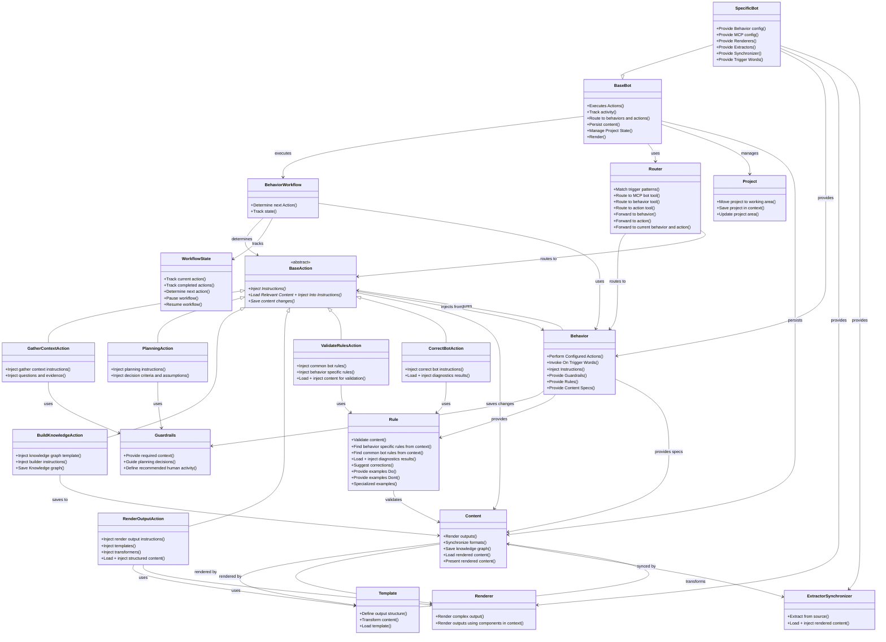

# Domain Model Diagram: Agile Bot Framework

## Complete Domain Model Class Diagram

---

## Source Material

**Primary Source**: agile_bot/bots/base_bot/docs/stories/story-graph.json  
**Domain Model**: agile_bot/bots/base_bot/docs/domain/base-bot-domain-model-outline.md  
**Phase**: Shape - Complete domain modeling  
**Date Generated**: 2025-12-02  
**Context**: Complete class diagram showing all domain concepts: Base Bot, Specific Bot, Behavior Workflow, Actions (1 abstract + 6 concrete), Behavior, Content, Guardrails, Rules, Router, Template, Renderer, Extractor/Synchronizer, Project, and Workflow State with all their relationships.
