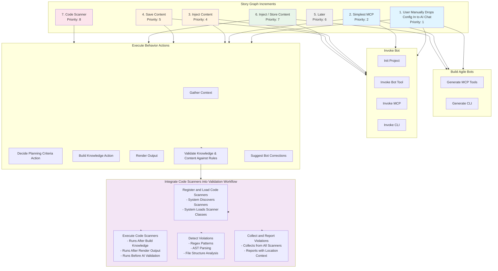

# Story Graph Increments Diagram

## Increment Details

### Inject / Store Content (Priority 7)
**Stories included:**
- **Build Agile Bots → Generate MCP Tools:**
  - Store Context Files
  - Stores Activity for Initialize Project Action

- **Invoke Bot → Invoke MCP:**
  - Save Through MCP

- **Invoke Bot → Invoke CLI:**
  - Save Through CLI

- **Execute Behavior Actions → Gather Context:**
  - Load + Inject Guardrails
  - Gather Context Saves To Context Folder

- **Execute Behavior Actions → Decide Planning Criteria Action:**
  - Save Final Assumptions and Decisions

- **Execute Behavior Actions → Build Knowledge:**
  - Load + Inject Knowledge Graph
  - Save Knowledge Graph

- **Execute Behavior Actions → Render Output:**
  - Load+ Inject Content Into Instructions
  - Save Content

- **Execute Behavior Actions → Validate Knowledge & Content Against Rules:**
  - Run Diagnostics + inject Results

### Code Scanner (Priority 8)
**Stories included:**
- **Execute Behavior Actions → Validate Knowledge & Content Against Rules → Integrate Code Scanners into Validation Workflow:**
  - **Register and Load Code Scanners:**
    - System Discovers Scanners from rule.json
    - System Loads Scanner Classes
  
  - **Execute Code Scanners:**
    - System Runs Scanners After Build Knowledge
    - System Runs Scanners After Render Output
    - System Runs Scanners Before AI Validation
  
  - **Detect Violations:**
    - Scanner Detects Violations Using Regex Patterns
    - Scanner Detects Violations Using AST Parsing
    - Scanner Detects Violations Using File Structure Analysis
  
  - **Collect and Report Violations:**
    - System Collects Violations from All Scanners
    - System Reports Violations with Location Context

