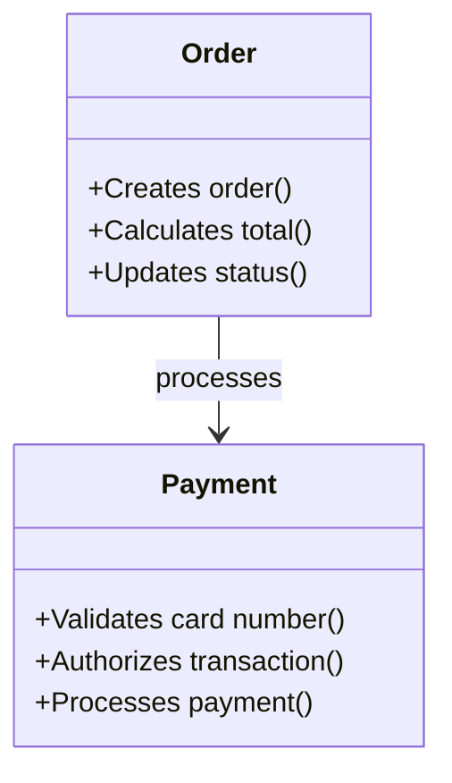

# Domain Model Diagram: {solution_name}

**File Name**: `{solution_name_slug}-domain-model-diagram.md`
**Location**: `{solution_folder}/{solution_name_slug}-domain-model-diagram.md`

## Solution Purpose
{solution_purpose}

---

## Domain Model Diagram

```mermaid
classDiagram
    class {ConceptName} {
        +{responsibility}()
        +{responsibility}()
        +{responsibility}()
    }
    
    class {AnotherConcept} {
        +{responsibility}()
        +{responsibility}()
    }
    
    %% Inheritance
    {ChildConcept} --|> {ParentConcept}
    
    %% Associations
    {ConceptName} --> {CollaboratorConcept} : {relationship_label}
    {ConceptName} --> {AnotherConcept} : uses
```

**Example:**


**Diagram Notes:**
- Domain concepts are shown as classes with their responsibilities
- Responsibilities are listed as methods in the class (format: +{responsibility}())
- Relationships show dependencies and associations between concepts
- Inheritance relationships show specialization (--|>)
- Associations show usage and collaboration (-->)

---

## Source Material

{source_material}
