# Domain Model Diagram: Scanner Validation System

**File Name**: `scanner-validation-domain-model.md`
**Location**: `agile_bot/bots/base_bot/docs/stories/scanner-validation-domain-model.md`

## Solution Purpose

Domain model for the scanner validation system showing resource-oriented design with proper delegation, encapsulation, and dependency chaining. This model represents the refactored architecture that addresses validation violations while maintaining domain-driven design principles.

---

## Domain Model Diagram

```mermaid
classDiagram
    class Rule {
        +Get name()
        +Get rule file()
        +Get scanner path()
        +Validates content()
    }
    
    class Violation {
        +Get rule()
        +Get violation message()
        +Get line number()
        +Get location()
        +Get severity()
        +Converts to dictionary()
    }
    
    class Scanner {
        <<abstract>>
        +Scans knowledge graph()
        +Scans file()
        +Scans cross file()
        +Checks if test file()
    }
    
    class PatternCollection {
        +Contains pattern()
        +Matches text()
    }
    
    class ScannerUtilities {
        +Creates violation()
        +Parses file safely()
        +Matches patterns()
        +Extracts line number()
    }
    
    class CodeScanner {
        +Scans code file()
        +Coordinates code validation()
    }
    
    class CodeStructureAnalyzer {
        +Analyzes code structure()
        +Examines AST for violations()
        +Identifies code patterns()
    }
    
    class CodeViolationReporter {
        +Reports violations()
        +Formats code violations()
        +Creates violation messages()
    }
    
    class TestScanner {
        +Scans test file()
        +Analyzes test structure()
        +Reports violations()
    }
    
    class StoryScanner {
        +Scans story node()
        +Analyzes story structure()
        +Reports violations()
    }
    
    class DuplicationScanner {
        +Coordinates duplication detection()
        +Orchestrates block analysis()
    }
    
    class BlockExtractor {
        +Extracts blocks from file()
        +Normalizes block content()
        +Identifies code blocks()
    }
    
    class SimilarityCalculator {
        +Calculates block similarity()
        +Groups similar blocks()
        +Compares block content()
    }
    
    class ViolationReporter {
        +Creates violation from block()
        +Formats violation message()
        +Reports duplicate blocks()
    }
    
    class ClassBasedOrganizationScanner {
        +Scans file organization()
        +Coordinates naming checks()
    }
    
    class FileNamingChecker {
        +Checks file name matches sub epic()
        +Validates file naming conventions()
    }
    
    class ClassNamingChecker {
        +Checks class name matches story()
        +Validates class naming conventions()
    }
    
    class MethodNamingChecker {
        +Checks method name matches scenario()
        +Validates method naming conventions()
    }
    
    class ComplexityMetrics {
        +Calculates cognitive complexity()
        +Detects responsibilities()
        +Measures code metrics()
    }
    
    class GivenWhenThenHelpersScanner {
        +Scans helper functions()
        +Validates GWT structure()
    }
    
    class ImportPlacementScanner {
        +Scans import placement()
        +Validates import order()
    }
    
    class IntentionRevealingNamesScanner {
        +Scans variable names()
        +Scans function names()
        +Validates naming clarity()
    }
    
    class RealImplementationsScanner {
        +Scans implementation details()
        +Validates real implementations()
    }
    
    class SpecificationMatchScanner {
        +Scans test specifications()
        +Validates spec matching()
    }
    
    class VerbNounScanner {
        +Scans verb noun format()
        +Validates naming format()
    }
    
    class BadCommentsScanner {
        +Scans comments()
        +Detects bad comments()
    }
    
    class ExcessiveGuardsScanner {
        +Scans guard clauses()
        +Detects excessive guards()
    }
    
    class FunctionSizeScanner {
        +Scans function size()
        +Detects large functions()
    }
    
    class ScannerRegistry {
        +Finds scanner by rule()
        +Loads scanner class()
        +Registers scanner()
    }
    
    %% Inheritance
    CodeScanner --|> Scanner
    TestScanner --|> Scanner
    StoryScanner --|> Scanner
    DuplicationScanner --|> Scanner
    ClassBasedOrganizationScanner --|> Scanner
    ComplexityMetrics --|> Scanner
    GivenWhenThenHelpersScanner --|> Scanner
    ImportPlacementScanner --|> Scanner
    IntentionRevealingNamesScanner --|> Scanner
    RealImplementationsScanner --|> Scanner
    SpecificationMatchScanner --|> Scanner
    VerbNounScanner --|> Scanner
    BadCommentsScanner --|> Scanner
    ExcessiveGuardsScanner --|> Scanner
    FunctionSizeScanner --|> Scanner
    
    %% Composition - CodeScanner decomposition
    CodeScanner --> CodeStructureAnalyzer : uses
    CodeScanner --> CodeViolationReporter : uses
    
    %% Composition - DuplicationScanner decomposition
    DuplicationScanner --> BlockExtractor : uses
    DuplicationScanner --> SimilarityCalculator : uses
    DuplicationScanner --> ViolationReporter : uses
    
    %% Composition - ClassBasedOrganizationScanner decomposition
    ClassBasedOrganizationScanner --> FileNamingChecker : uses
    ClassBasedOrganizationScanner --> ClassNamingChecker : uses
    ClassBasedOrganizationScanner --> MethodNamingChecker : uses
    
    %% Associations
    Rule --> Scanner : creates
    Scanner --> Violation : creates
    Scanner --> PatternCollection : uses
    Scanner --> ScannerUtilities : uses
    ScannerRegistry --> Scanner : manages
    Rule --> ScannerRegistry : finds scanner through
    Violation --> Rule : references
    CodeStructureAnalyzer --> Violation : creates
    CodeViolationReporter --> Violation : creates
    FileNamingChecker --> Violation : creates
    ClassNamingChecker --> Violation : creates
    MethodNamingChecker --> Violation : creates
```

**Diagram Notes:**
- Domain concepts are shown as classes with their responsibilities
- Responsibilities are listed as methods in the class (format: +{responsibility}())
- Relationships show dependencies and associations between concepts
- Inheritance relationships show specialization (--|>)
- Associations show usage and collaboration (-->)
- Composition shows ownership (--> with "uses" label)

---

## Domain Concepts and Responsibilities

### Rule
**Responsibilities:**
- Get name: Returns rule identifier
- Get rule file: Returns path to rule configuration
- Get scanner path: Returns scanner module path
- Validates content: Coordinates validation process

**Collaborators:**
- Scanner (creates scanner instances)
- ScannerRegistry (finds scanner through registry)
- Violation (receives violations from scanner)

---

### Violation
**Responsibilities:**
- Get rule: Returns rule that created violation
- Get violation message: Returns description of violation
- Get line number: Returns line where violation occurs
- Get location: Returns file or knowledge graph location
- Get severity: Returns error/warning/info level
- Converts to dictionary: Serializes violation for reporting

**Collaborators:**
- Rule (references rule that created it)

---

### Scanner (Abstract Base)
**Responsibilities:**
- Scans knowledge graph: Validates story graph structure
- Scans file: Validates individual file
- Scans cross file: Validates patterns across multiple files
- Checks if test file: Determines file type for context-aware scanning

**Collaborators:**
- PatternCollection (uses for pattern matching)
- ScannerUtilities (uses for common operations)
- Violation (creates violations)

---

### PatternCollection
**Responsibilities:**
- Contains pattern: Checks if pattern exists in collection
- Matches text: Determines if text matches any pattern

**Collaborators:**
- Scanner (used by scanners for pattern matching)

---

### ScannerUtilities
**Responsibilities:**
- Creates violation: Factory method for violation creation
- Parses file safely: Handles file parsing with error handling
- Matches patterns: Checks text against pattern collection
- Extracts line number: Gets line number from AST node

**Collaborators:**
- Violation (creates violations)
- Scanner (used by scanners)

---

### CodeScanner
**Responsibilities:**
- Scans code file: Validates Python code files
- Coordinates code validation: Orchestrates validation process

**Collaborators:**
- CodeStructureAnalyzer (delegates structure analysis)
- CodeViolationReporter (delegates violation reporting)
- PatternCollection (uses for code pattern matching)
- ScannerUtilities (uses for common operations)

---

### CodeStructureAnalyzer
**Responsibilities:**
- Analyzes code structure: Examines AST for violations
- Identifies code patterns: Detects code structure patterns
- Examines AST for violations: Traverses AST nodes

**Collaborators:**
- CodeScanner (used by code scanner)
- Violation (creates violations)
- ScannerUtilities (uses for common operations)

---

### CodeViolationReporter
**Responsibilities:**
- Reports violations: Creates and returns violations
- Formats code violations: Formats violation messages for code issues
- Creates violation messages: Generates descriptive violation messages

**Collaborators:**
- CodeScanner (used by code scanner)
- Violation (creates violations)
- ScannerUtilities (uses for common operations)

---

### TestScanner
**Responsibilities:**
- Scans test file: Validates test files
- Analyzes test structure: Examines test methods and classes
- Reports violations: Creates and returns violations

**Collaborators:**
- PatternCollection (uses for test pattern matching)
- ScannerUtilities (uses for common operations)
- Violation (creates violations)

---

### StoryScanner
**Responsibilities:**
- Scans story node: Validates story graph nodes
- Analyzes story structure: Examines story/epic/scenario structure
- Reports violations: Creates and returns violations

**Collaborators:**
- PatternCollection (uses for story pattern matching)
- ScannerUtilities (uses for common operations)
- Violation (creates violations)

---

### DuplicationScanner
**Responsibilities:**
- Coordinates duplication detection: Orchestrates duplication analysis
- Orchestrates block analysis: Coordinates block extraction and comparison

**Collaborators:**
- BlockExtractor (delegates block extraction)
- SimilarityCalculator (delegates similarity calculation)
- ViolationReporter (delegates violation reporting)
- PatternCollection (uses for helper pattern matching)

---

### BlockExtractor
**Responsibilities:**
- Extracts blocks from file: Identifies code blocks in file
- Normalizes block content: Standardizes block representation

**Collaborators:**
- DuplicationScanner (used by duplication scanner)

---

### SimilarityCalculator
**Responsibilities:**
- Calculates block similarity: Compares blocks for similarity
- Groups similar blocks: Organizes blocks by similarity

**Collaborators:**
- DuplicationScanner (used by duplication scanner)

---

### ViolationReporter
**Responsibilities:**
- Creates violation from block: Generates violation for duplicate block
- Formats violation message: Creates descriptive violation messages

**Collaborators:**
- Violation (creates violations)
- DuplicationScanner (used by duplication scanner)

---

### ClassBasedOrganizationScanner
**Responsibilities:**
- Scans file organization: Validates file organization structure
- Coordinates naming checks: Orchestrates naming validation

**Collaborators:**
- FileNamingChecker (delegates file name checking)
- ClassNamingChecker (delegates class name checking)
- MethodNamingChecker (delegates method name checking)
- Violation (creates violations)

---

### FileNamingChecker
**Responsibilities:**
- Checks file name matches sub epic: Validates file naming against sub-epic
- Validates file naming conventions: Ensures file names follow conventions

**Collaborators:**
- ClassBasedOrganizationScanner (used by organization scanner)
- Violation (creates violations)

---

### ClassNamingChecker
**Responsibilities:**
- Checks class name matches story: Validates class naming against story names
- Validates class naming conventions: Ensures class names follow conventions

**Collaborators:**
- ClassBasedOrganizationScanner (used by organization scanner)
- Violation (creates violations)

---

### MethodNamingChecker
**Responsibilities:**
- Checks method name matches scenario: Validates method naming against scenarios
- Validates method naming conventions: Ensures method names follow conventions

**Collaborators:**
- ClassBasedOrganizationScanner (used by organization scanner)
- Violation (creates violations)

---

### ComplexityMetrics
**Responsibilities:**
- Calculates cognitive complexity: Measures function complexity
- Detects responsibilities: Identifies multiple responsibilities
- Measures code metrics: Calculates various code metrics

**Collaborators:**
- Scanner (used by scanners for complexity analysis)
- Violation (creates violations)

---

### GivenWhenThenHelpersScanner
**Responsibilities:**
- Scans helper functions: Validates GWT helper functions
- Validates GWT structure: Ensures proper Given-When-Then structure

**Collaborators:**
- PatternCollection (uses for helper pattern matching)
- ScannerUtilities (uses for common operations)
- Violation (creates violations)

---

### ImportPlacementScanner
**Responsibilities:**
- Scans import placement: Validates import statement placement
- Validates import order: Ensures imports are at top of file

**Collaborators:**
- ScannerUtilities (uses for common operations)
- Violation (creates violations)

---

### IntentionRevealingNamesScanner
**Responsibilities:**
- Scans variable names: Validates variable naming clarity
- Scans function names: Validates function naming clarity
- Validates naming clarity: Ensures names reveal intention

**Collaborators:**
- PatternCollection (uses for generic name patterns)
- ScannerUtilities (uses for common operations)
- Violation (creates violations)

---

### RealImplementationsScanner
**Responsibilities:**
- Scans implementation details: Validates real implementation usage
- Validates real implementations: Ensures concrete implementations

**Collaborators:**
- ScannerUtilities (uses for common operations)
- Violation (creates violations)

---

### SpecificationMatchScanner
**Responsibilities:**
- Scans test specifications: Validates test specification matching
- Validates spec matching: Ensures tests match specifications

**Collaborators:**
- ScannerUtilities (uses for common operations)
- Violation (creates violations)

---

### VerbNounScanner
**Responsibilities:**
- Scans verb noun format: Validates verb-noun naming format
- Validates naming format: Ensures proper verb-noun structure

**Collaborators:**
- PatternCollection (uses for verb patterns)
- ScannerUtilities (uses for common operations)
- Violation (creates violations)

---

### BadCommentsScanner
**Responsibilities:**
- Scans comments: Validates comment quality
- Detects bad comments: Identifies problematic comments

**Collaborators:**
- ScannerUtilities (uses for common operations)
- Violation (creates violations)

---

### ExcessiveGuardsScanner
**Responsibilities:**
- Scans guard clauses: Validates guard clause usage
- Detects excessive guards: Identifies unnecessary guard clauses

**Collaborators:**
- ScannerUtilities (uses for common operations)
- Violation (creates violations)

---

### FunctionSizeScanner
**Responsibilities:**
- Scans function size: Validates function length
- Detects large functions: Identifies functions exceeding size limits

**Collaborators:**
- ComplexityMetrics (uses for complexity analysis)
- ScannerUtilities (uses for common operations)
- Violation (creates violations)

---

### ScannerRegistry
**Responsibilities:**
- Finds scanner by rule: Locates scanner for given rule
- Loads scanner class: Dynamically loads scanner class
- Registers scanner: Adds scanner to registry

**Collaborators:**
- Scanner (manages scanner instances)
- Rule (finds scanner through rule)

---

## Design Principles Applied

### Resource-Oriented Design
- ScannerRegistry replaces ScannerLoader (manager pattern)
- PatternCollection encapsulates pattern matching logic
- ScannerUtilities provides shared functionality without manager pattern

### Delegation to Lowest Level
- DuplicationScanner delegates to BlockExtractor, SimilarityCalculator, ViolationReporter
- CodeScanner delegates to CodeStructureAnalyzer, CodeViolationReporter
- ClassBasedOrganizationScanner delegates to FileNamingChecker, ClassNamingChecker, MethodNamingChecker
- PatternCollection handles pattern matching instead of scanners iterating
- ScannerUtilities handles common operations instead of duplicating code

### Encapsulation Through Properties
- Violation exposes properties (Get rule, Get message) not raw data
- PatternCollection exposes Contains pattern, not internal pattern list
- ScannerRegistry exposes Finds scanner, not internal registry structure

### Dependency Chaining
- Rule → ScannerRegistry → Scanner (proper chain)
- Scanner → PatternCollection → Pattern matching (delegation)
- Scanner → ScannerUtilities → Violation creation (shared utilities)

### Grouping by Domain
- All scanner-related concepts grouped together
- Validation concepts (Rule, Violation) grouped together
- Utility concepts (PatternCollection, ScannerUtilities) grouped together

---

## Class Size Refactoring

This domain model reflects the class size refactoring plan (Increment 2.4) where large classes are split into focused, single-responsibility classes:

### Large Classes Split:
1. **DuplicationScanner (2001 lines)** → Split into:
   - DuplicationScanner (core orchestration)
   - BlockExtractor (block extraction logic)
   - SimilarityCalculator (similarity calculations)
   - ViolationReporter (violation reporting)

2. **ClassBasedOrganizationScanner (611 lines)** → Split into:
   - ClassBasedOrganizationScanner (core orchestration)
   - FileNamingChecker (file naming validation)
   - ClassNamingChecker (class naming validation)
   - MethodNamingChecker (method naming validation)

3. **CodeScanner (438 lines)** → Split into:
   - CodeScanner (core orchestration)
   - CodeStructureAnalyzer (code structure analysis)
   - CodeViolationReporter (violation reporting)

4. **Other Large Classes** (maintained as single classes but following same patterns):
   - ComplexityMetrics, GivenWhenThenHelpersScanner, ImportPlacementScanner
   - IntentionRevealingNamesScanner, RealImplementationsScanner, SpecificationMatchScanner
   - VerbNounScanner, BadCommentsScanner, ExcessiveGuardsScanner, FunctionSizeScanner

### Refactoring Benefits:
- Each class has single responsibility (≤300 lines)
- Clear separation of concerns
- Easier to test and maintain
- Better encapsulation through delegation

---

## Source Material

Based on scanner validation violations fix plan (Increments 1.4 and 2.4) and domain rules:
- use_resource_oriented_design.json
- delegate_to_lowest_level.json
- encapsulate_through_properties.json
- chain_dependencies_properly.json
- group_by_domain.json
- favor_code_representation.json

