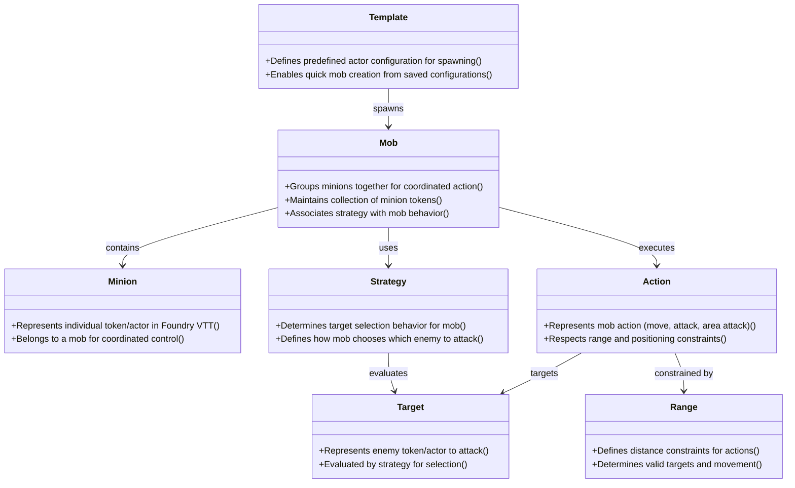

# Domain Model Diagram: Mob Minion

**File Name**: `mob-minion-domain-model-diagram.md`
**Location**: `demo/mob_minion/docs/stories/mob-minion-domain-model-diagram.md`

## Solution Purpose

This system enables Game Masters to efficiently manage minions in Foundry Virtual Tabletop (VTT) by grouping them into coordinated mobs. Mobs allow GMs to control multiple minions as a single unit, applying strategies for target selection and executing coordinated actions. The system integrates with Foundry VTT's existing actor/token, combat, movement, and template systems.

---

## Domain Model Diagram

**Diagram Notes:**
- Domain concepts are shown as classes with their responsibilities
- Responsibilities are listed as methods in the class (format: +{responsibility}())
- Relationships show dependencies and associations between concepts
- Associations show usage and collaboration (-->)
- **Mob** is the central concept that coordinates minions and strategies
- **Strategy** evaluates **Target** options to determine mob behavior
- **Action** execution is constrained by **Range** limitations
- **Template** enables quick mob creation from saved configurations

---

## Source Material

- **Input Document**: `demo/mob_minion/input.txt` - Project vision and requirements
- **Clarification**: `demo/mob_minion/docs/stories/clarification.json` - Domain understanding and user context
- **Story Graph**: `demo/mob_minion/docs/stories/story-graph.json` - Structured story map with domain concepts

